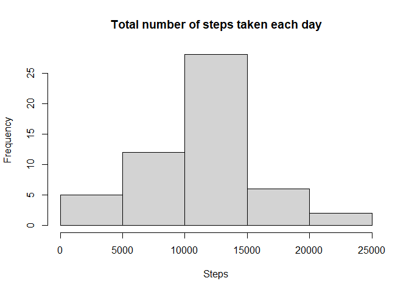
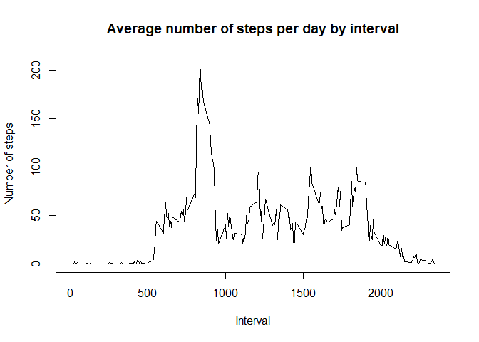
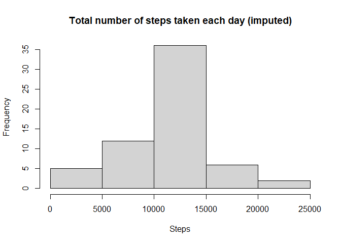
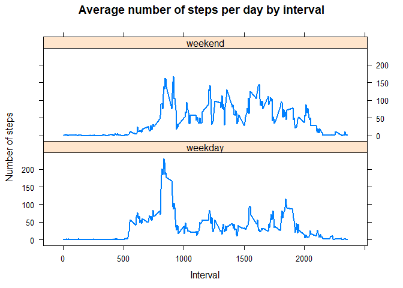

## Loading and preprocessing the data


## What is mean total number of steps taken per day?

```r
steps=aggregate(steps ~ date, dat, sum)
hist(steps$steps, 
     main = "Total number of steps taken each day", 
     xlab = "Steps")
```

<!-- -->

```r
smean1=mean(steps$steps)

smedian1=median(steps$steps)
```
The mean and median of the total number of steps taken per day are 1.0766189\times 10^{4} and 10765 respectively.

## What is the average daily activity pattern?

```r
steps1=aggregate(steps ~ interval, dat, mean)
plot(steps1$interval,steps1$steps, type="l", 
     main="Average number of steps per day by interval",
     xlab="Interval", ylab="Number of steps")
```

<!-- -->

```r
smax=steps1$interval[which.max(steps1$steps)]
```

The 835 interval contains the maximum number of steps.

## Imputing missing values

```r
missing=sum((is.na(dat$steps)))
```

There are 2304 missing values in the dataset.


```r
d1=dat 

for (i in steps1$interval) {
    d1[d1$interval == i & is.na(d1$steps), ]$steps = steps1$steps[steps1$interval == i]
}
head(d1)
```

```
##       steps       date interval
## 1 1.7169811 2012-10-01        0
## 2 0.3396226 2012-10-01        5
## 3 0.1320755 2012-10-01       10
## 4 0.1509434 2012-10-01       15
## 5 0.0754717 2012-10-01       20
## 6 2.0943396 2012-10-01       25
```

```r
steps2=aggregate(steps ~ date, d1, sum)

hist(steps2$steps, 
     main = "Total number of steps taken each day (imputed)", 
     xlab = "Steps")
```

<!-- -->

```r
smean2=mean(d1$steps)

smedian2=median(d1$steps)

smean3=smean1-smean2  # difference in mean before and after imputation 

smedian3=smedian1-smedian2  # difference in median before and after imputation 

sum(is.na(d1))
```

```
## [1] 0
```

The mean and median of the total number of steps taken per day are 37.3825996 and 0 respectively.
The mean and median changed 1.0728806\times 10^{4} and 1.0765\times 10^{4} respectively.

## Are there differences in activity patterns between weekdays and weekends?

```r
d1$week=weekdays(as.Date(d1$date))
d1$week[d1$week %in% c("Saturday","Sunday")]="weekend"
d1$week[!d1$week=="weekend"]="weekday"

steps3=aggregate(steps ~ interval + week, d1, mean)

xyplot(steps ~ interval | week, data = steps3, type="l",  lwd = 2,
        layout = c(1, 2), 
        main="Average number of steps per day by interval",
        xlab="Interval", ylab="Number of steps")
```

<!-- -->


